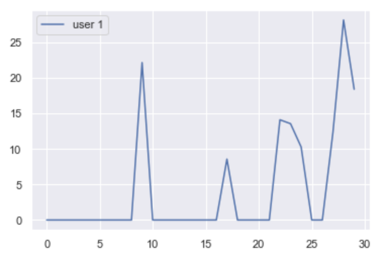
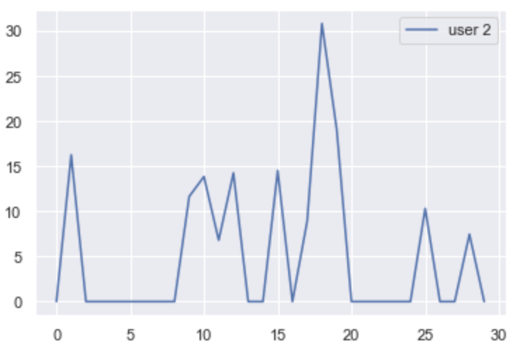

# Starbuck Machine Learning Project

**Author:** Leo Li
**Mentor:** Kanja Saha

---

## 1. Problem Statement

This is a supervised learning classification problem. Specifically, it is a multi-label classification problem.

#### Here is a brief description of the problem

We have 8 different type of coupons. For each consumer, during the given time period of 30 days, we know if a user has successfully used a coupon. Since a consumer can use multiple coupon (these events are not exclusive to each other), it is a `multi-label binary classification problem`.

A succcessful model can predict how likely a consumer will use one of the 8 types of coupons. Hense help the brand to send promotion to the target consumer, and, of course, capture to most value out of the person.

## 2. Domain Knowledge

The business world is changing. With massive consumer traffic data available we can understand consumer behavior deeper than ever before. Brands can capture more value by `correctly giving out coupons` to stimulate consumers that are “sensitive” to these rewards, in the same time, `avoid` giving coupon to consumer that are already buying the product.

The machine learning knowledge here is to tackle a `multi-label  binary classification problem`. A good reference paper can be found here:
[Relevance efficacy for multilabel classification](https://link.springer.com/content/pdf/10.1007%2Fs13748-012-0030-x.pdf)

## 3. Benchmark Model

Use `K-nearest neighbor` model as it is a fast and standard method for binary classification machine learning problems.

Reason for using KNN:
1. It provides a quick way to train the model and test the result.
2. Because we only have `12` features, KNN will provide a fairly good result as its dimension is low.

That being said, a quick and fairly accurate model will make it a good benchmark model.

## 4. Evaluation Metrics

### ROC_AUC
Since it is a binary classfication problem, we will evaluate with `Area under the Curve (AUC) of Receiver Operating Characteristic (ROC) `

source: [understanding-auc-roc-curve](https://towardsdatascience.com/understanding-auc-roc-curve-68b2303cc9c5)

### Recall

We would rather give coupon to a consumer, even he/she won't use it, than missing a consumer that are potentially buying coffee. So recall is a more important measure than precision

source: [Recall definition from Wikipedia](https://en.wikipedia.org/wiki/Precision_and_recall)

### Feature Importance

We will also run a `feature importance analysis` on the features. This can be done using `feature_importances_`

```python
import os
import pandas as pd
from sklearn.ensemble import RandomForestClassifier
df = pd.read_csv(os.path.join('assets/', 'train_test.csv'))

X = df[:, 1:]
y = df[:, 0]
clf = RandomForestClassifier(n_estimators=100,
                             random_state=11,
                            min_samples_split=10)
                            
feat_importances = pd.Series(clf.feature_importances_, index=X.columns)
```

## 5. Dataset and Inputs

#### Raw Dataset
#### 5.1 Portfolio

There are a total of `10` type of promotions, but `2` of them are just informational, hense we don't care. The other `8` are actual coupons

```bash
id	                             reward	   channels	  difficulty	duration	offer_type				
ae264e3637204a6fb9bb56bc8210ddfd	10	[email, mobile, social]	10	7	bogo
4d5c57ea9a6940dd891ad53e9dbe8da0	10	[web, email, mobile, social]	10	5	bogo
3f207df678b143eea3cee63160fa8bed	0	[web, email, mobile]	0	4	informational
9b98b8c7a33c4b65b9aebfe6a799e6d9	5	[web, email, mobile]	5	7	bogo
0b1e1539f2cc45b7b9fa7c272da2e1d7	5	[web, email]	20	10	discount
2298d6c36e964ae4a3e7e9706d1fb8c2	3	[web, email, mobile, social]	7	7	discount
fafdcd668e3743c1bb461111dcafc2a4	2	[web, email, mobile, social]	10	10	discount
5a8bc65990b245e5a138643cd4eb9837	0	[email, mobile, social]	0	3	informational
f19421c1d4aa40978ebb69ca19b0e20d	5	[web, email, mobile, social]	5	5	bogo
2906b810c7d4411798c6938adc9daaa5	2	[web, email, mobile]	10	7	discount
```
Things that are interesting to us:

`difficulty`: how much do you need to spend to trigger the reward;

`duration`: maximum time for the user to complete the offer;

#### 5.2 Consumer Profile
Let's print out the top 5 rows of the table.
```bash
	gender	age	id	became_member_on	income
0	None	118	68be06ca386d4c31939f3a4f0e3dd783	20170212	NaN
1	F	55	0610b486422d4921ae7d2bf64640c50b	20170715	112000.0
2	None	118	38fe809add3b4fcf9315a9694bb96ff5	20180712	NaN
3	F	75	78afa995795e4d85b5d9ceeca43f5fef	20170509	100000.0
4	None	118	a03223e636434f42ac4c3df47e8bac43	20170804	NaN
```
In this dataset there are data that are `not valid`, if we look at `gender`, `age` and `income` variables, some values don't make sense or are `None`s.

The total valid consumer number is `14825`.

#### 5.3 Transcript
```bash
person	event	value	time
0	78afa995795e4d85b5d9ceeca43f5fef	offer received	{'offer id': '9b98b8c7a33c4b65b9aebfe6a799e6d9'}	0
1	a03223e636434f42ac4c3df47e8bac43	offer received	{'offer id': '0b1e1539f2cc45b7b9fa7c272da2e1d7'}	0
2	e2127556f4f64592b11af22de27a7932	offer received	{'offer id': '2906b810c7d4411798c6938adc9daaa5'}	0
3	8ec6ce2a7e7949b1bf142def7d0e0586	offer received	{'offer id': 'fafdcd668e3743c1bb461111dcafc2a4'}	0
4	68617ca6246f4fbc85e91a2a49552598	offer received	{'offer id': '4d5c57ea9a6940dd891ad53e9dbe8da0'}	0
```
event has 4 types: `offer received`, `offer viewed`, `offer complete`, and `transactions`.

We want to know if the user has successfully complete an offer. We will use the above information to create the target table


We need to create both `features` and `targets`, let's work on `target` first.

#### 5.4 Target Inputs

This table represent for each `consumer (row)`, if they have complete one of the eight `coupon (column)` during the given time frame (30 days)
```bash
	person	ae264e3637204a6fb9bb56bc8210ddfd	4d5c57ea9a6940dd891ad53e9dbe8da0	9b98b8c7a33c4b65b9aebfe6a799e6d9	0b1e1539f2cc45b7b9fa7c272da2e1d7	2298d6c36e964ae4a3e7e9706d1fb8c2	fafdcd668e3743c1bb461111dcafc2a4	f19421c1d4aa40978ebb69ca19b0e20d	2906b810c7d4411798c6938adc9daaa5							
7366bef4c288476dab78b09a33d0e692	0	1	0	0	0	0	0	0
b854f7297f9e4ecb9d02845941b87479	0	0	0	0	0	0	0	0
b912b714bf5e40609f6ff25a9a542a9c	0	0	0	0	0	1	0	0
46b3c686bbbd4495940b4da488e10ed6	1	1	0	0	1	0	0	0
a14d4f2ec359464f8d4aeac17b755903	1	0	0	0	1	1	0	
```
Total `14825` rows and `8` columns
Columns are `coupon id`, rows are `consumer id`

#### 5.5 Feature Inputs

1. Profile related
`gender`, `age`, `income`, `time since membership`

I would love to see how well only these 4 features performs, as these features are easy to obtain for Starbucks. And then decided if we should include more information


2. Consumer behavior related
`Avg Daily spending on Coffee(float)`, `Highest daily spending(float)`,`lowest spending (not include 0)(float)`, `std spending (not include 0)(float)`, `days in a month spending below $5(int)`, `days in a month spending from $5 to $10(int)`, `days in a month spending from $10 to $15(int)`, `days in a month spending from $15 to $20(int)`, `days in a month spending over $20(int)`

Here are the top 5 rows of the dataframe
```bash
Avg Daily spending	Highest daily spending	Lowest daily spending	count days no spending	count days spending 0_to_5	count days spending 5_to_10	count days spending 10_to_15	count days spending 15_to_20	count days spending 20_plus	std_daily_spending
person										
0009655768c64bdeb2e877511632db8f	4.253333	28.16	8.57	22.0	0.0	1.0	1.0	1.0	2.0	7.867232
00116118485d4dfda04fdbaba9a87b5c	0.136333	3.39	0.70	28.0	2.0	0.0	0.0	0.0	0.0	0.627653
0011e0d4e6b944f998e987f904e8c1e5	2.648667	23.03	8.96	25.0	0.0	1.0	1.0	0.0	2.0	6.461309
0020c2b971eb4e9188eac86d93036a77	6.562000	49.63	17.24	24.0	0.0	0.0	0.0	1.0	5.0	14.444319
0020ccbbb6d84e358d3414a3ff76cffd	5.135000	30.84	6.81	19.0	0.0	3.0	3.0	2.0	1.0	7.923300
```

## 6. Solution Statement

Use `Adaboost/Gradient Boosting` along with `Decision Tree` Classifier or `Random Forest` method to predict what coupon should we give to a user based on input features


### Workflow
There are `3` steps for our pipeline 

 #### 6.1 Data Cleaning and Reformatting
 The raw data we have are `portfolio`, `profile` and `portfolio`. We want to know for each consumer, what are the trend
 of their buying activities (trends) as well as   
 
 - We dropped user profile that has missing data 
 - we group the transaction into a day by day format (column) by each consumer (row)
 - based on `view` and `complete` info of transaction on each day, we can calculate on each day if a consumer has a
 valid coupon completion, and what is the `id` of this coupon (see `out/valid_complete_day_df.csv`), and we can group 
 them by coupon `id` (see `training_data/target.csv`), this is our target data.
 
 
 
 
 consumer trend examples
 
 #### 6.2 Feature Engineering
 
 #### Feature Group 1
 - we turn `profile` string columns `gender`, `become member on` into numeric data:
     - `gender` {female: 0, male: 1}
     - `become member on` {`current time` - `become member on`}
     
 Above is `training_data/feature_group_1`
 
 #### Feature Group 2 
 - based on the consumer trend information we created from the raw data(`out/completed_trend_day_df.csv`), we calculate
 `feature_group_2` dataFrame, see `5. Data and Input (above)`
 
 This is our `feature_group_2`
 
 #### 6.3 Training & Evaluation
 
 Since it is a multi-label ML problem, for each target(total `8`):
 
     - We will first run a KNN only based on all features 
     - We run a feature importance analysis on features, if necessary, we reduce the dimension using PCA
     - We apply random forest multi-label classifier
     - evaluate with ROC_AUC / Recall / Accuracy
     - Improve with Hyper-parameter tuning
     